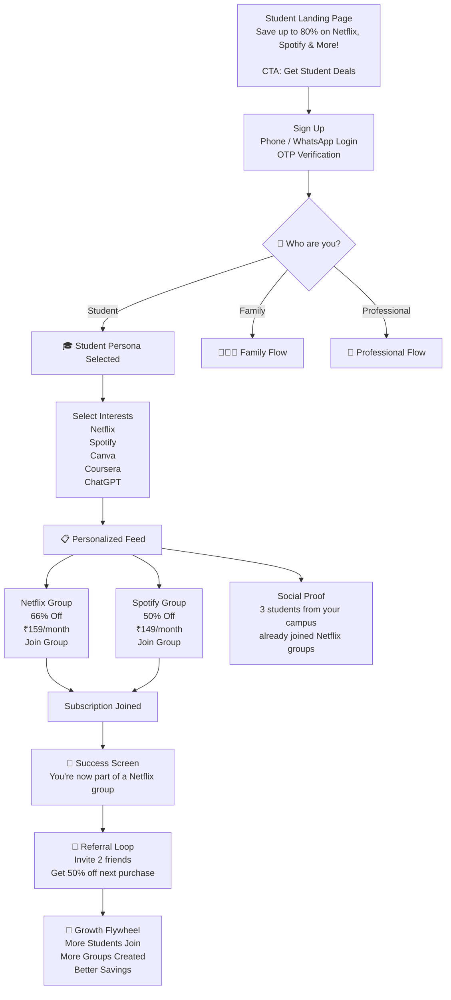
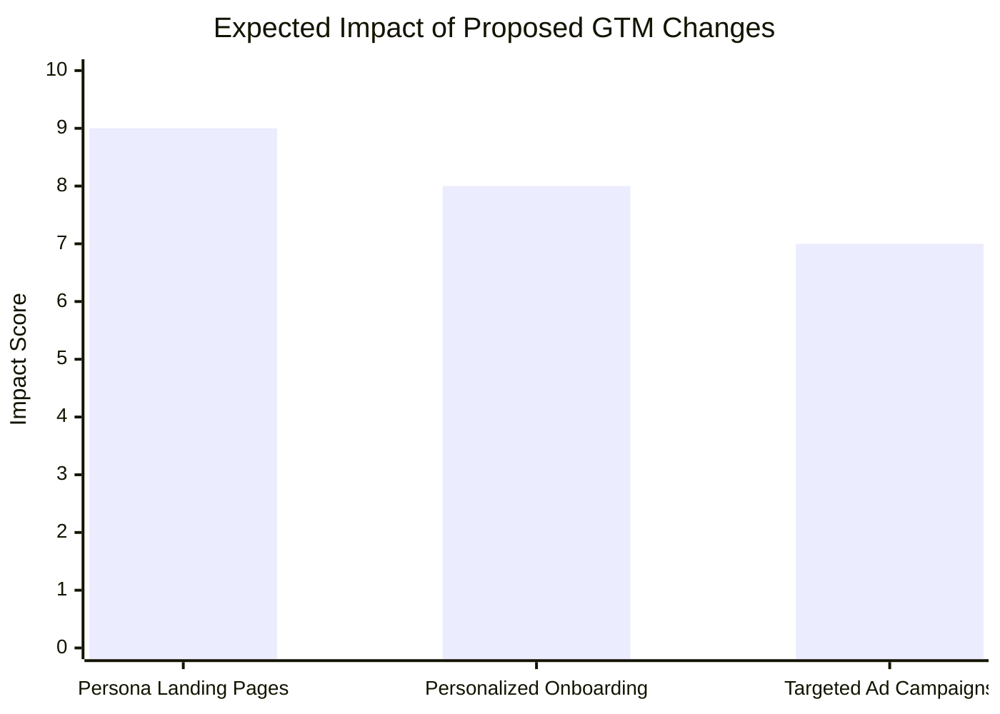

# Executive Summary  
Subspace’s current messaging is unfocused: it tries to address *students, families, professionals, gift-card buyers*, etc., all at once.  New visitors see a generic “Your subscription management platform” banner and broad blog categories (e.g. *Students, General Users, OTT*) but no clear primary user. This dilutes the value proposition and likely hurts conversion and increases CAC (users aren’t sure if the app is for them).  To fix this, we should *segment the GTM (Go‑To‑Market) by ICP*: pick ~3 personas (e.g. “**Student Saver**”, “**Family Manager**”, “**Young Professional**”), and create tailored landing pages, onboarding flows, and marketing copy for each. By speaking directly to each persona’s needs (with relevant hero images, examples of subscriptions, and ad angles), we can improve relevance, lift conversion, and boost retention. Key KPIs (landing conversion, activation, retention) should be tracked by segment. Below is one detailed feedback entry focusing on GTM & ICP, followed by ICP personas, a prioritization matrix, metrics, and an example onboarding microflow.

### Observed  
- **Inconsistent positioning:** The homepage copy is generic e.g. **“Your subscription management platform”** (no mention of *who* it’s for). After login it shows sections like *Favourite Brands* and *Shared Subscriptions*, but these are not explained or tied to a user type on the landing page.  
- **Broad “About Us” claims:** The “About Us” page emphasizes general finance management: *“simplifies splitting expenses with friends, tracking bills, and saving money.”* It even highlights a business model around group gift‑card purchases. In short, the site’s own wording swings between “subscription sharing”, “expense splitting”, and “group deals”, which can confuse users about the core use-case.  
- **Diverse blog categories:** The official blog lists tags for **Students**, **General Users**, **OTT**, **Payments**, **Merchants**, etc. This indicates Subspace is producing content for multiple audiences (students hunting deals, entertainment subscribers, casual spenders, etc.). However, none of these segments is clearly called out on the main marketing pages or sign-up flow.  

Collectively, these observations show Subspace is *trying to appeal to everyone*: there’s no immediate clue on the homepage which persona it’s targeting. A new user (say a college student or a family) has to guess whether Subspace solves *their* specific problem, which can increase drop-offs and dilute marketing efficiency.

### Problem  
**Diluted messaging means unclear ICP → lower conversion and higher CAC.** In startup GTM, if you present a vague value prop, potential users will often click away rather than invest time. For example, a student seeing “Your subscription management platform” without mention of student discounts won’t immediately realize Subspace has student deals; they may leave to a competitor (like a student-focused coupon site). Similarly, families might not know Subspace can help them pool Netflix/Disney+ costs since the homepage doesn’t say “for families”. This ambiguity raises acquisition costs (ads must target broadly, with lower relevance) and hurts organic conversion (higher bounce rate). It also weakens retention: if a user signs up thinking “maybe this is for me” but then finds a cluttered feed not focused on their interests, they won’t stay engaged. In short, **not defining clear ICPs costs Subspace low efficiency on both user acquisition and activation**.

### Ship Instead  
**Segment the GTM by primary personas.** Identify the top 3 ICPs (see below) and tailor the experience for each. For each persona, create specific messaging, landing pages, and onboarding flows:

- **Persona-tailored landing pages:** Instead of one generic homepage, have targeted landing sections or separate routes. E.g.: *“Students, save up to 80% on Netflix, Spotify, Canva & more! Split your OTT and study tool subscriptions with peers.”* vs *“Families: Manage and share all household subscriptions in one place – cut costs on Netflix, broadband, and learning apps.”* vs *“Professionals/Startups: Share expensive productivity tools (Adobe, Notion, AWS) at half price.”* Each page should have relevant hero images (students, a family, a coworking team) and example subscriptions. **A/B test**: Compare a generic hero vs. a segmented hero by measuring landing CTA clicks.  

- **Onboarding questionnaire:** After sign-up, ask users which category describes them (Student / Family / Pro, etc.) or what subscriptions they care about. Based on the answer, default them into a curated feed. For example, a student choosing “Entertainment & Learning” would immediately see Netflix, Spotify, Coursera deals. A family would see household staples. This personalization can be guided by copy like *“Let’s personalize Subspace for you. What are you looking to share or save on today?”* with multi-choice icons.  

- **Customized content and UX:** Once segmented, show dynamic content. E.g. students see student-popular brand logos; families see kid-friendly or group-plans; professionals see tech subscriptions. Rename navigation tabs if needed (e.g. “Student Deals” tab). Remove irrelevant sections for each persona to reduce clutter. For example, hide the “Groups of 10” deal if a user is not in that segment.

- **Targeted acquisition channels and ad copy:** Run marketing campaigns focused on each ICP. Example ad headlines:  
  - *“Students: 66% OFF Netflix – Join a 2-person Netflix group on Subspace!”* (link to Student landing page)  
  - *“Families: Cut Your Cable Bill in Half – Manage all subscriptions in one app.”* (link to Family landing page)  
  - *“Freelancers/Teams: Share $52 Adobe Plan for $26 each – No contracts.”* (link to Professional landing page)  

  Each campaign should drive to the matching segmented landing page.  **Metrics to track:** Click-through rate (CTR) and conversion by campaign, then adjust budgets accordingly.

- **Measurement & A/B tests:** For all changes, instrument the funnel. Track landing-page CR, sign-up rate, and first-subscription-join rate for each segment. Run A/B tests on persona headlines and signup flows (e.g. “Join group” vs “Browse deals” CTAs). Key A/B ideas: test “generic hero vs student hero” for the student ad, or “Ask persona vs show deals immediately” at sign-up. Use uplift in sign-ups and retention in segment audiences as decision criteria.  

These solutions prioritize the user’s perspective at every step. By speaking directly to each ICP, Subspace can increase relevance (improving conversion), reduce waste in broad marketing, and foster habit-forming use (boosting retention) within each target group.

## Recommended ICP Segmentation  

Based on the product scope and site cues, focus on three personas:  

- **Student Saver** (Age ~18–25): Undergraduate/graduate students. *Motivations:* Low income, heavy OTT/learning tool usage. *Key use-cases:* Splitting Netflix, Spotify, Coursera, Canva among friends; finding student discounts. *Channels:* College campuses, student forums, Reddit, TikTok.  
- **Family Manager** (Age ~30–50): Parents or shared households. *Motivations:* Simplify family budget, reduce duplicate subscriptions. *Key use-cases:* Managing house-wide subscriptions (streaming, broadband, news), splitting costs with spouse/kids, tracking payments. *Channels:* Facebook groups, community forums, blogs about parenting/finance.  
- **Young Professional/Startup** (Age ~25–35): Tech-savvy workers or small startup teams. *Motivations:* Minimize business and productivity costs, use premium tools. *Key use-cases:* Sharing SaaS subscriptions (Adobe, Notion, AWS), gym or skill subscriptions with coworkers; managing recurring work expenses. *Channels:* LinkedIn, tech newsletters, startup communities.  

Each persona would see customized messaging and feature emphasis aligned with their profile.

## Prioritization (Impact vs Effort)

|                | **High Effort**                                         | **Low Effort**                        |
|:--------------:|:------------------------------------------------------:|:-------------------------------------:|
| **High Impact**| **Persona-specific landing pages & flows** - Create separate hero text/images for each ICP. (Medium effort: new copy + assets.) - Implement onboarding quiz + dynamic feed. (Medium effort: dev work, but high impact on conversion.) | **Targeted ad campaigns** - Launch segmented ads for each ICP (Low effort using existing assets). - Update hero banner copy (e.g. “Students: Save 80% on Netflix”) (Very low effort tweak). |
| **Low Impact** | Expand blog categories/tags (High effort for low gain in core KPI). | Minor UI polish (Low effort; e.g. FAQ on safety) |

## KPIs & Targets  
- **Landing-to-Signup Conversion:** Baseline this for current homepage (~5–10%). Target **+50%** uplift for persona pages (e.g. reach ~12–15%).  
- **Activation (First Join):** % of sign-ups who immediately join a subscription or group. Target **≥40%** (ensure onboarding quiz leads to action).  
- **CAC by Channel:** Measure cost per sign-up for each ad campaign. Aim to lower CAC by **20–30%** vs. untargeted spend by improving relevancy.  
- **Retention/MAU:** Track 1-month and 3-month active rates by persona. E.g. aim for **30%+** 1-month retention for students (higher if messaging is relevant).  
- **Referral/Invites Sent:** Number of invitees per user (viral coefficient). A well-targeted promo (e.g. “Invite a friend, you both get $5 off”) should improve virality. (Target a 1.5x increase in invite rate.)  
- **A/B Test Metrics:** Lift in CTR or sign-up from persona vs. generic variants (e.g. +5% CTR on student-targeted hero).  

Each KPI should be measured and compared against pre-change baselines and industry benchmarks (e.g. ~10–20% CR is good for landing pages, CAC targets depend on LTV).

## Sample User Onboarding Microflow (Student Persona)

1. **Landing Page (Student Hero):** Display **“Students: Save up to 80% on Netflix, Spotify & More!”** with student-friendly images. *CTA:* “Get Student Deals – Sign Up Now.”  
2. **Sign-Up Screen:** Prompt phone/WhatsApp login: *“Join in 2 taps and unlock massive student discounts!”* User enters number, receives OTP.  
3. **Persona Question:** *“Who are you?”* Options: _Student (checkbox)_ / “Family” / “Professional”. (Student tapped.)  
4. **Interest Selection:** *“Great! What services do you want to save on?”* Show icons: Netflix, Spotify, Canva, Coursera, etc. Student taps Netflix & Spotify.  
5. **Results Feed:** Show curated deals/groups:  
   - *“Netflix – 66% off (Join a 2-person group at ₹159)”* 🔗[Join Group]  
   - *“Spotify – 50% off (Join a 4-person group at ₹149)”* 🔗[Join Group]  
   Also display friend recommendations: *“3 students from your campus have joined Netflix Groups.”*  

6. **Confirmation & Onboarding Complete:** After joining (or browsing), show *“Congrats! You’re now in a Netflix group. Refer 2 friends and you get 50% off your next purchase.”*  

*Figure: Onboarding microflow for the Student persona (example screens and copy snippets).*

## Visual Impact Comparison  
Below is a small bar chart comparing the **expected impact scores** of three proposed changes (scale 1–10):

*Figure: Expected impact scores for proposed changes (1 = low impact, 10 = high). Landing pages and onboarding personalization score highest.*  