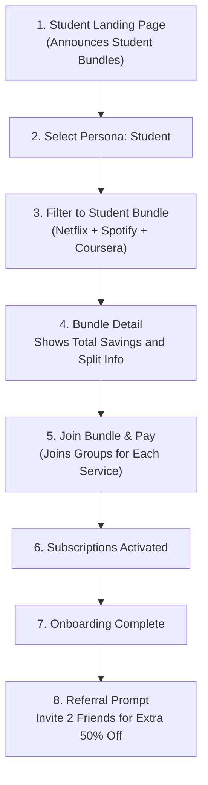
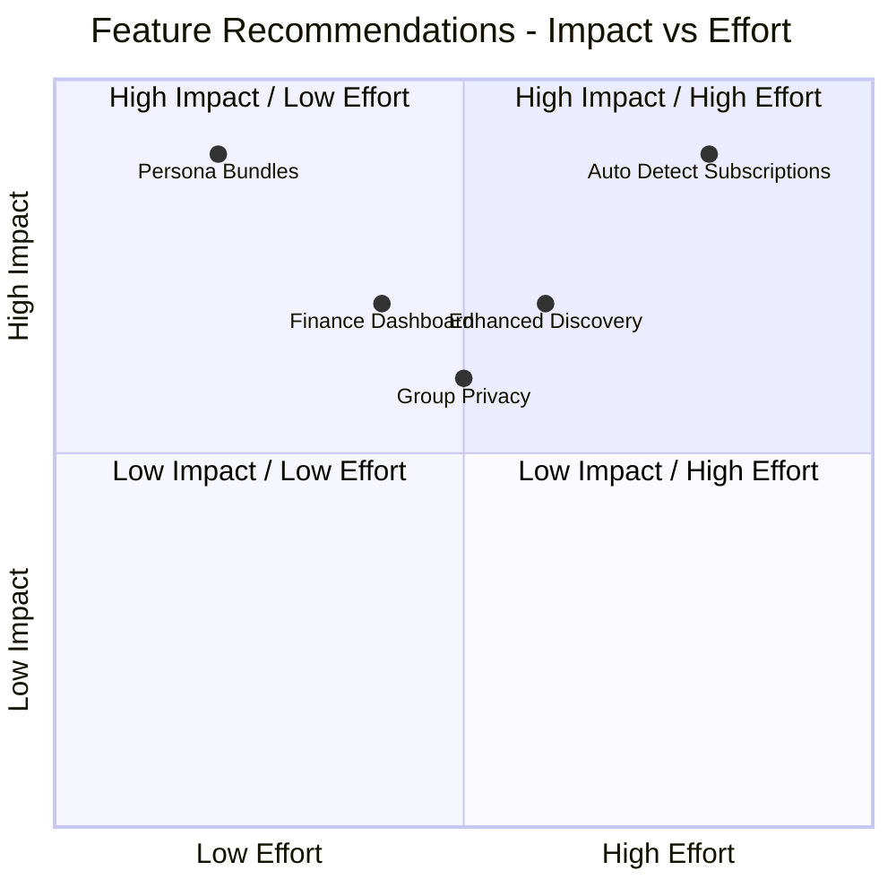

## Executive Summary  
Subspace’s current app positions itself as an all-in-one subscription marketplace (“Buy, Track, Split and Manage Subscriptions”) but offers few targeted discovery or management tools. My audit found that while Subspace highlights features like finance breakdowns and discounts, it lacks advanced discovery, personalization, and trust features. The recommendations below address these gaps with **persona-targeted bundles**, smarter discovery, automated tracking, detailed analytics, and stronger group privacy. Each is paired with impact, complexity, and priority estimates, and a table contrasts current versus proposed features.

| **Current Feature** | **Subspace (as described)** | **Proposed Improvement** |
|--------------------|----------------------------------|--------------------------|
| **Subscription Discovery** | Manual search by name; flat list of “Shared Subscriptions”. | **Persona Bundles & Filters:** Curated bundles (e.g. *Student Pack*, *Family Pack*) and category filters (OTT, Music, Productivity). Improves relevancy for key ICPs. |
| **Group Sharing** | Public share groups (users “make group public”) and basic chat. | **Private/Invite Groups & Social:** Allow private invite-only groups and richer group chats; show social proof (e.g. friends joined). Increases trust. |
| **Subscription Tracking** | “Track” feature exists (user adds subscriptions manually) no auto import. | **Auto-Detect & Alerts:** Link bank/UPI to auto-detect recurring payments (like Truebill-style); send renewal alerts and trial reminders. |
| **Financial Insights** | Mentions a “breakdown of finances” but no visible dashboard. | **Budget Dashboard:** Add spending analytics (charts, category spend, savings over time) to help users visualize and manage bills. |
| **Deals & Wallet** | Occasional gift card deals via blog; basic Wallet to hold funds. | **Integrated Deals Marketplace:** Surface personalized deals (e.g. student discounts) and expand gift-card store in-app. |

### 1. Persona-Based Subscription Bundles  
- **Observed:** Subspace lists all categories of subs (OTT, music, productivity, etc.)but the UI offers no tailored bundles or category filters. Users see a generic “Shared Subscriptions” feed (see *Home* page layout).  
- **Problem:** New users (e.g. students or families) must guess which subscriptions to join. This dilutes conversion — people may not realize the app has deals for their needs. Without curated bundles, the first value is hidden.  
- **Ship Instead:** Create *persona bundles* on the homepage and Explore tab. For example: **Student Pack** (Netflix + Spotify + Coursera), **Family Essentials** (Disney+ Hotstar + Airtel Xstream), **Work Pro Bundle** (Notion + VPN + Office 365). Each bundle shows total savings and a “Join All” CTA. Onboarding can ask “Who are you?” (Student/Family/Pro) and immediately show relevant bundles.  
- *ICP:* Students, families, young professionals (each bundle explicitly speaks to an ICP)  
- *Priority:* **High** – boosts first-time engagement for target users.  
- *Effort:* **Medium** – requires UI for bundles, a bit of curation/marketing copy.  
- *Impact:* **9** – clarifies value proposition, likely increasing conversion and average revenue per user.  
- *Competitive Gap:* Many shopping apps (e.g. bundled service deals) show curated packs for segments. Subspace should match that to onboard users faster.  

### 2. Enhanced Discovery & Filtering  
- **Observed:** The *Explore* screen (post-login) currently defaults to a generic subscription list and “Favourite Brands” section (placeholder logos). There’s no filter or category browsing, nor an in-app recommendation engine mentioned. (The site’s blog emphasizes manual discovery.)  
- **Problem:** As the marketplace grows, users may struggle to find specific services. Lack of filtering by category, price, or user type means high-effort discovery. This can frustrate users and raise drop-offs.  
- **Ship Instead:** Implement search filters and recommendations. Add UI toggles (OTT vs music vs gaming), price range sliders, and “Trending Deals” carousels. For logged-in users, recommend subs based on past joins (e.g. “Because you joined Netflix…”) or friends’ activities (see *Student Onboarding* flow later). Track click-throughs on suggestions.  
- *ICP:* All segments (improves navigation for anyone browsing).  
- *Priority:* **Medium** – important once the catalog grows.  
- *Effort:* **Medium** – extends current Explore UI; needs data tags and analytics.  
- *Impact:* **7** – smoother discovery reduces churn and increases the number of subscriptions per user.  
- *Competitive Gap:* Unlike simple list-based apps, e-commerce sites (and even apps like Netflix) use robust filtering. Subspace should adopt similar tactics to stay usable as features scale.  

### 3. Auto-Detect Subscriptions & Alerts  
- **Observed:** The marketing claims “linking bank accounts... automatically detects recurring payments” and promises alerts for upcoming renewals. In practice, the only user flows shown (in blog and app UI) involve manual search/add of each subscription (including a manual Google Play top-up step). No actual bank-linking flow is visible on the site.  
- **Problem:** Manual entry is tedious and error-prone. Users might skip adding an old subscription and lose money. Moreover, no proactive alerts mean forgotten renewals. This undermines Subspace’s positioning as a complete management tool.  
- **Ship Instead:** Build (or integrate) a bank/UPI linkage feature that scans transactions to import active subscriptions. When detected, auto-add them to the user’s dashboard. Send push/WhatsApp reminders before each renewal or trial expiry. Track metrics: # of auto-detected subs and % of payments caught by alerts (goal: >80%). Even partial implementation (e.g. import CSV from bank) would be beneficial.  
- *ICP:* Busy users and families (anyone with multiple payments).  
- *Priority:* **High** – directly impacts retention and savings.  
- *Effort:* **Large** – involves fintech integration and compliance.  
- *Impact:* **9** – A truly automated experience would differentiate Subspace (and save users significant money).  
- *Competitive Gap:* Fintech apps like Truebill or MoonPig offer auto-discovery of subscriptions. Subspace should catch up on this core subscription-management feature.  

### 4. Personal Finance Dashboard  
- **Observed:** The blog touts an “effortless breakdown of finances to see where users’ money is going”. However, aside from the generic wallet balance and spend summary, there’s no detailed in-app analytics shown. The UI (home page) has no charts or spending categories visible.  
- **Problem:** Without clear visuals of spending over time or by category, users can’t easily spot overspending or savings. This weakens the “manage subscriptions” promise: users may add subs but still feel unsure about their budget impact.  
- **Ship Instead:** Add a **Dashboard** screen under *Account* or *Wallet* showing charts and metrics: monthly subscription spend over time, breakdown by category (OTT vs gaming vs utility), and total savings (via shared subs). Show KPIs like “You saved ₹X this month” or “Subscriptions per category”. Use retention of active users and time spent on dashboard as metrics.  
- *ICP:* All users (especially professionals and families who budget carefully).  
- *Priority:* **Medium** – enhances value but not strictly necessary for core sharing.  
- *Effort:* **Medium** – data is largely available; requires front-end visualization.  
- *Impact:* **8** – Increases engagement (users visit to check stats) and reinforces savings narrative.  
- *Competitive Gap:* Personal finance apps (e.g. Mint) have spending dashboards. Subspace can leverage its own data to provide similar insights, giving it an edge over bare-bones share apps.  

### 5. Group Privacy & Trust Enhancements  
- **Observed:** The sharing process in the help doc shows users are instructed to “Make your Group Public”, implying groups default to open. The UI offers a generic *Chat* tab (likely for group chat), but no mention is made of group privacy settings or host verification.  
- **Problem:** Users may be reluctant to pay strangers for a shared subscription without trust signals. Public groups risk scams or misuse. This trust gap could slow onboarding or drive users to informal solutions like asking friends via WhatsApp.  
- **Ship Instead:** Implement private-group options and trust badges. Allow group hosts to keep a group *invite-only* (not public). Verify hosts via KYC or invite-link sharing. Display labels such as “Verified Host” or “High Trust” on group listings. In group chat, offer an “Invite a Friend” link and show if friends of the user have joined. Track conversion rates of public vs. private groups.  
- *ICP:* All users, especially risk-averse ones (families, older professionals).  
- *Priority:* **High** – critical for user confidence in money-sharing.  
- *Effort:* **Medium** – modifying group settings and UI, plus simple verification.  
- *Impact:* **6** – increases conversions on group joins, reduces support issues from scams.  
- *Competitive Gap:* Expense-sharing apps (like Splitwise) allow private groups. Subspace should ensure similar privacy defaults. Adding social proof features (e.g. “3 of your contacts use Subspace” as in our mock flow) can further build trust.  

*Figure: Example user flow for a “Student Bundle” – the app guides the student persona to a curated bundle, streamlining discovery and purchase.*

*Figure: Impact-vs-Effort for the above five feature improvements. Higher points are more valuable; e.g. Persona Bundles (high impact, low effort) sits top-left, while Auto-Detect subs is high impact but higher effort.*  
