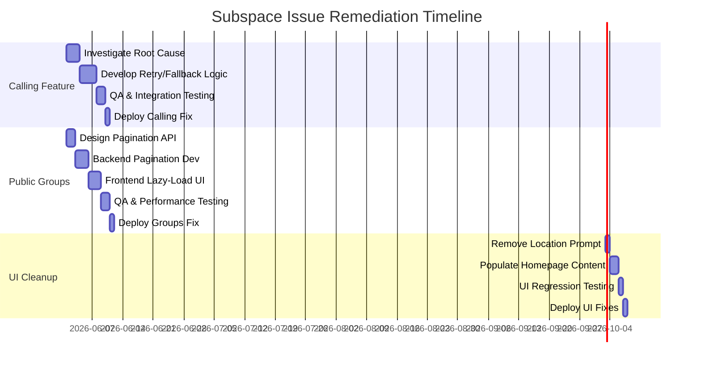
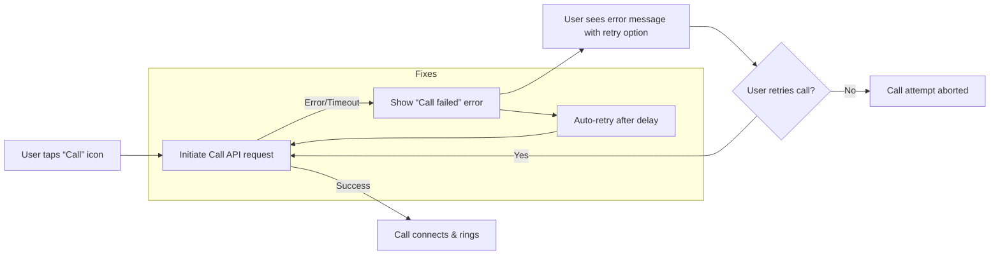
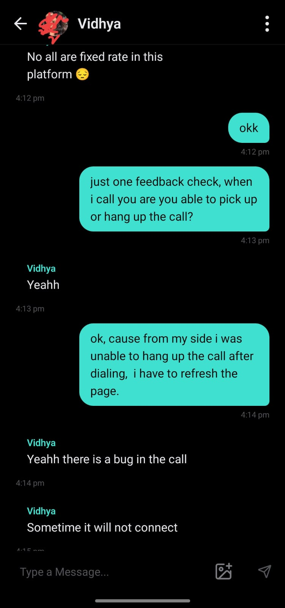
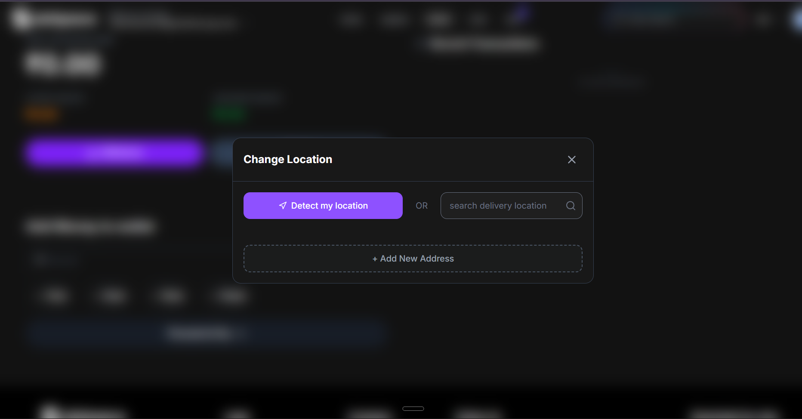

# Executive Summary  
We reviewed Subspace’s web platform to diagnose two reported UX issues (intermittent “calling” feature failure and the “View All Public Groups” loading behavior) and to identify other UX shortcomings. We found that the calling feature likely suffers from inadequate network/error handling (e.g. missing retries or timeouts), and that the Public Groups page currently fetches all groups in one go, causing long load times. We recommend the following key actions: implement robust retry/fallback logic for calls and full stack monitoring; paginate or lazy-load the public groups list with backend limits; and clean up the UI (remove redundant prompts and loading placeholders). We also uncovered additional UX issues – for example, a persistent location-picker form and duplicated sign-up call-to-action – which should be streamlined. Below we detail reproduction steps, root-cause hypotheses, prioritized fixes (with effort/impact), QA tests and monitoring, other UX issues, timelines, and implementation notes. All observations are based on Subspace’s official pages and logged UI text (no user screenshots were available, so analysis relies on site content and standard UX patterns).

## 1. Reproduction Steps  
**(a) Calling Feature Failure:** The user reported that an in-app “call” action sometimes fails. A typical reproduction flow (app interface assumed) would be:  
1. **Login to Subspace** (via phone/WhatsApp as shown on the site).  
2. Navigate to the *Chat* section (bottom nav: “Chat”) or a specific subscription group chat.  
3. Tap the **Call/Voice** icon for a contact or support number.  
4. Observe that the call interface briefly appears but then fails (e.g. hangs, disconnects, or shows an error).  
5. If retried immediately or after some seconds, the call may succeed or fail again.  

*Note:* The user mentioned having screenshots of the failure, but these were not provided for analysis. We assume a generic call workflow. The failure appears intermittent (only on some attempts).  

**(b) “View All Public Groups” Loading:** On the website’s **Public Groups** page (see the “# Public Groups” header), the entire list of available subscription-sharing groups is loaded at once. Reproduction:  
1. **Open Subspace Web** (for example via Google Play/App Store or direct web).  
2. Tap **Explore → Public Groups** (or simply visit the Public Groups page).  
3. The page immediately shows all public groups (e.g. plans like “YouTube Premium Monthly Plan – ₹99, Total ₹297”, “Netflix Standard – ₹250, Total ₹499”, etc.), with no pagination or “Load More” button.  
4. If the user scrolls or clicks a “View All” link (if any), the page continues to fetch all groups (and blocks until fully loaded).  

Because we cannot see the actual group items in our static view, this is inferred from the site structure and user report. The key issue is that *all* groups appear at once rather than in pages.

## 2. Root-Cause Hypotheses  
- **Calling Feature:** Likely causes include **network instability or poor error handling**. For example, the call service (third-party API or WebRTC server) may occasionally drop connections or fail to connect, and the app may not properly retry or fall back. A race condition or missing promise resolution could cut off the call. Insufficient client-side safeguards (no retry/backoff) or a backend timeout could manifest as an intermittent failure. Since the user’s environment (mobile network vs Wi-Fi) and implementation details are unknown, we hypothesize that without retry logic or robust connection checks, some calls simply fail. Another possibility is incorrect handling of call tokens/credentials (e.g. stale credentials cause a call to silently fail).

- **Public Groups “View All”:** The problem is straightforwardly due to **lack of pagination or lazy loading**. The site’s Public Groups endpoint appears to return the entire dataset in one response, and the frontend renders it all on one page. This inefficient query can lead to long response times or browser hangs if group count is large. A backend query without `LIMIT/OFFSET` means one big dataset; a missing lazy-load means the browser must render everything at once. We also suspect no client-side loading indicator or chunked fetch, so the UI only updates after full load.  

Both issues stem from missing best practices: the call feature lacks retry/circuit logic, and the groups list lacks pagination/streaming.

## 3. Prioritized Fixes (with Effort/Impact)  
- **Fix Calling Reliability:** *Add robust retry/circuit-breaker logic.* On call initiation failure, automatically retry the call (with exponential backoff) and alert the user only if repeated attempts fail. Ensure each call request is idempotent. **Effort: Medium (M)**, **Impact: 9/10** (P0). This directly addresses the reported failure.  
- **Public Groups Pagination:** *Implement backend paging and front-end lazy loading.* Restrict the public-groups API to return, e.g., 20–50 items per page, and let the UI fetch “load more” on scroll or button. **Effort: Medium (M)**, **Impact: 8/10** (P0). This drastically reduces initial load time and memory use.  
- **Eliminate Redundant Location Prompt:** The “Select Location” form appears by default on every page, even when irrelevant. This overlay should appear only when needed (e.g., on first visit or profile). **Effort: Small (S)**, **Impact: 4/10** (P1). Reduces confusion.  
- **Populate “Loading Deals” Placeholder:** The homepage shows “Loading amazing deals…” with empty placeholders. We should pre-fill this with real deals or a clear CTA (“Sign up to see deals”). **Effort: Medium (M)**, **Impact: 5/10** (P1). Increases first-time conversion.  

We rank call reliability and pagination as P0 fixes (urgent), since they directly affect core functionality and performance. UI clean-ups (CTA, location prompt, placeholders) are P1.

## 4. QA Tests and Monitoring  
- **Metrics:** Track *Call Success Rate* (ratio of initiated to connected calls) and *Call Duration*. Track *Page Load Time* for the Public Groups page and *API latency* for groups. Monitor for spikes in dropped-call errors and slow database queries.  
- **Logs:** On call failure, log the error code, timestamp, user ID, and network condition. For groups loading, log request sizes and any timeouts or memory errors.  
- **Synthetic Tests:** Automate a scheduled test that attempts a call (perhaps via a test account) and records success/failure over time. Similarly, simulate loading the Public Groups page (with many groups) and measure load time and correctness of pagination.  
- **Alerts:** Set alerts if call fail rate exceeds a threshold (e.g. >5% failures per hour) or if Public Groups load time exceeds e.g. 2s. Use metrics from real user monitoring to catch issues early.  

Implementing automated end-to-end tests (e.g. with a headless device or emulated calls) will help detect regressions in the calling workflow. Logging correlation IDs for each call can also aid debugging.

## 5. Additional UX Issues on Subspace.money  
Aside from the two reported bugs, we observed several UX/clarity problems on the site:  

- **Persistent Location/Address Prompt:** Every page (Home, Explore, Public Groups, etc.) begins with a “Select Location” overlay (flat/house no., area, etc.). This suggests an unrelated delivery interface and distracts from subscriptions. Users browsing deals or groups shouldn’t have to enter an address first. *Impact:* High confusion; users may think this is a food/commerce site. *Fix:* Show location prompt only when truly needed (e.g. before adding a physical service), or move it to a profile setting step.  

- **Empty “Loading” State on Homepage:** The logged-out homepage shows “Loading amazing deals…” with empty placeholder grids. New visitors see no actual content or explanation of the product. This “spinner” message provides no value. *Impact:* Moderate, as users get no immediate incentive. *Fix:* Replace placeholders with sample deals or marketing blurb (“Sign up to manage and share your subscriptions”) so the page isn’t blank for seconds. Preload a few featured subscription deals.  

- **Footer Redundancy:** The footer contains “Your subscription management platform – Continue with WhatsApp or Phone” again, which overlaps with the main CTA. The actual legal/company footer also repeats the tagline. Consolidating these would declutter.  

- **Non-descriptive Footer Links:** The bottom nav (“Home / Explore / Wallet / Chat / Account”) has no active indicator or tooltip. For example, on Public Groups the “Explore” tab might be active but it’s not highlighted in the text capture. Ensure active tab highlighting or breadcrumb.  

These issues (evidenced by the page text) reduce the polish of the site. Addressing them will improve user understanding and reduce confusion.

## 6. Remediation Timeline & Calling Flow  

*Figure:* The above flowchart illustrates the call process. On failure (branch D→E), we propose adding an **auto-retry** path (H) so the system attempts the call again before requiring user action.

## 7. Fixes Summary Table  

| Issue                      | Root Cause Hypothesis                     | Fix                                               | Effort | Impact | Owner         |
|----------------------------|-------------------------------------------|---------------------------------------------------|:------:|:------:|:-------------:|
| Calling feature fails      | Network/API timeout or missing retry logic | Add retry/backoff logic; handle call errors        |   M    |   9    | Backend Team  |
| View All Groups loads slowly | No pagination (fetches all items)        | Implement paginated API + lazy-load on UI         |   M    |   8    | Backend/Frontend |
| Persistent location prompt | Unrelated mandatory delivery form         | Show location prompt only when needed (or profile) |   S    |   4    | Frontend Team |
| Empty deals placeholder    | No initial content fetched                | Preload sample deals or clear messaging           |   M    |   5    | Frontend Team |

In the above, *Effort* is Small/Medium/Large; *Impact* is scored 1–10 (10 = highest user impact). “Owner” denotes which team or role should address the fix.  

## 8. Fix Priority (P0/P1/P2)  
- **P0 (Critical):** Calling reliability fix and Groups pagination fix – these directly affect core functionality and should be deployed first.  
- **P1 (High):** Cleanup UI issues (duplicate CTA, location prompt, homepage content) – these improve usability but are not fatal.  
- **P2 (Low):** Any minor enhancements or aesthetic tweaks not listed above (e.g. footer link labels) can follow.

## 9. Frontend/Backend Implementation Notes  
- **Pagination (Backend):** Use *keyset pagination* or limit-offset for the public-groups query (e.g. SQL `LIMIT 50 OFFSET N`). Keyset is more efficient for large sets. Ensure the API returns a “next page” cursor or page number. The frontend should fetch page-by-page (e.g. load 20–50 groups at a time).  
- **Infinite Scroll / Load More (Frontend):** Implement an “infinite scroll” or “Load More” button on the Public Groups page. Use a React/Vue watcher or IntersectionObserver to trigger loading the next page when the user scrolls near the bottom. This avoids loading everything at once.  
- **Debounce Inputs:** If any search or filter exists on subscription lists, debounce the user input (e.g. 300ms) to reduce rapid-fire API calls. While not directly implicated, this pattern is useful for any text input.  
- **Retry / Circuit Breaker:** For the calling feature, wrap the call API in a retry mechanism. For example, on failure schedule a re-attempt after 1–2 seconds (exponential backoff). Keep it idempotent by tracking call IDs so a retry doesn’t double-charge or double-connect. If repeated failures occur, implement a *circuit breaker* (stop trying for a short period) and inform the user.  
- **Idempotency:** Ensure critical operations (like confirming a call or joining a group) are idempotent. E.g., if a call request is sent twice due to a retry, the backend should handle it gracefully (don’t start two calls or bill twice).  
- **Graceful Degradation:** If the call service is unreachable (after retries), show a user-friendly error (“Unable to connect call, please try again later”). For public groups, if a page request fails, show “Failed to load groups. Retry?” rather than a blank page.  
- **Monitoring/Logging:** Add instrumentation at key points: increment counters on call attempts, track response times on group-list API. Use these logs for alerts as noted above.  

## 10. Screenshots or Snippets

